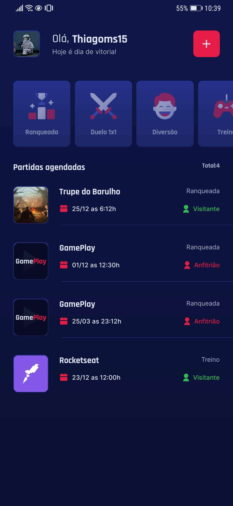
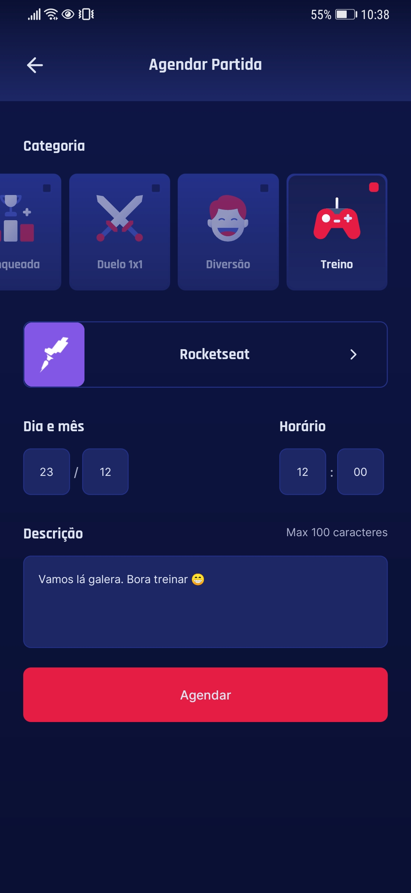
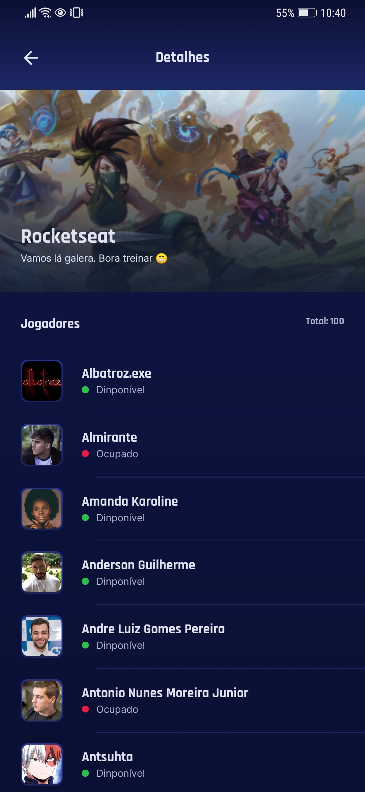

# This app was developed in the `NLW Together`.

<h1 align="center">
  
</h1>

<p align="center">
  

 
</p>


## 💻 1. Description
This app was developed using `React Native` .

- Schedule your games with your friend;
- Connect with your ***Discord account*** .


You can access the layout [here](https://www.figma.com/file/FlXZbqp1cPulpcWbQiJDF8/GamePlay---NLW-Together?node-id=58913%3A83).

### 1.1 Screenshots

| ***Welcome***  |  ***Home***  |
| ------------------- | ------------------- |
|   |    |


| ***Schedule***  |  ***Details***  |
| ------------------- | ------------------- |
|  |  |


___
## 2. How to:

### 2.1. Install dependencies

```
$ npm install --global expo-cli
$ yarn global add expo-cli
$ expo install expo-font @expo-google-fonts/rajdhani
$ expo install expo-font @expo-google-fonts/inter
$ expo install expo-linear-gradient
$ expo install expo-app-loading
$ expo install react-native-gesture-handler react-native-reanimated react-native-screens react-native-safe-area-context @react-native-community/masked-view
$ yarn add @react-navigation/native
$ yarn add @react-navigation/stack
$ expo install react-native-svg
$ yarn add --dev react-native-svg-transformer
$ yarn add dotenv babel-plugin-inline-dotenv
$ expo install @react-native-async-storage/async-storage
$ yarn add react-native-uuid
$ expo install expo-auth-session expo-random
$ yarn add axios
$ yarn add react-native-iphone-x-helper

```

### 2.2. Run expo server


```
$ expo start
```

After start the server change to `Tunnel`.

___

## 📄 3. License

This project is under MIT license. Take a look in [LICENSE](LICENSE.md) for more details.

___

Created with ❤️ by Thiago Marques.